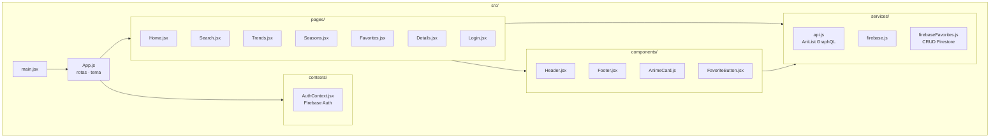
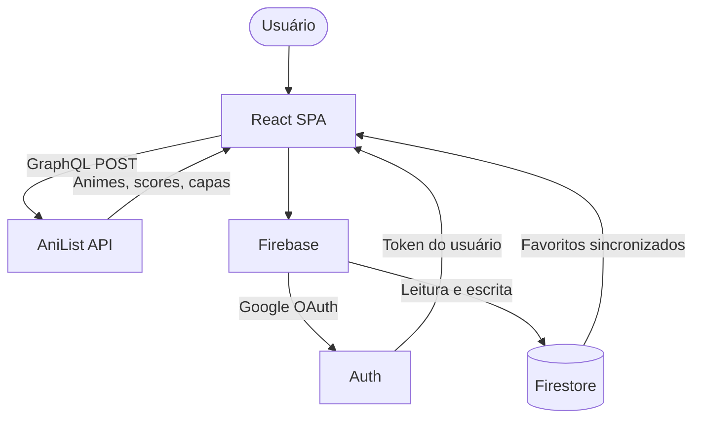
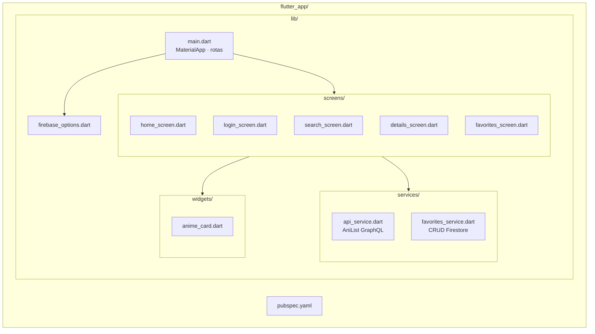
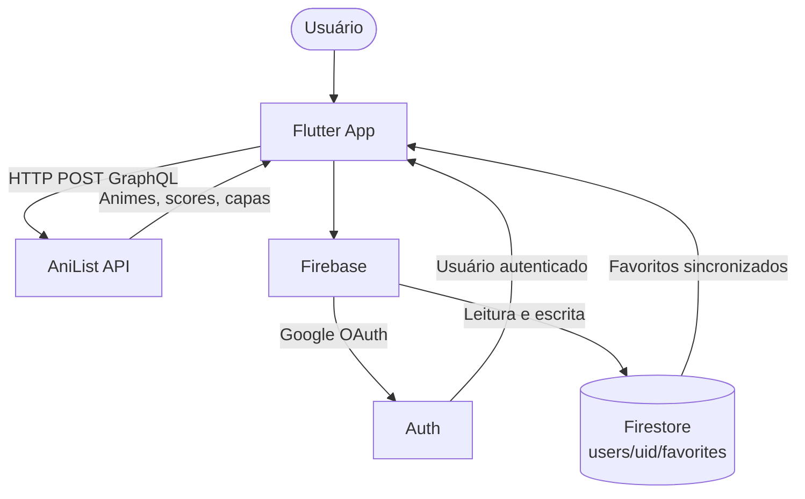
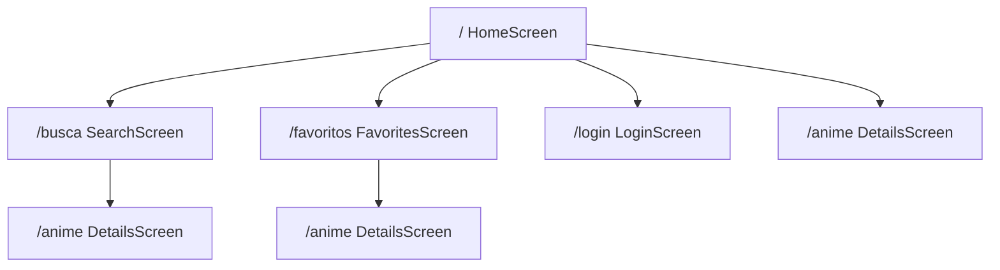

<div align="center">

# AniData
### Anime Intelligence Node

**Plataforma de descoberta e curadoria de animes com dados em tempo real via AniList.**  
Disponível como **aplicação web (React)** e **app mobile (Flutter)**.

</div>

---

## Índice

- [Sobre o Projeto](#sobre-o-projeto)
- [Web — React](#web--react)
  - [Tecnologias Web](#tecnologias-web)
  - [Arquitetura Web](#arquitetura-web)
  - [Instalação e Uso](#instalação-e-uso)
  - [Prints Web](#prints-web)
  - [Acesso Online](#acesso-online)
- [Mobile — Flutter](#mobile--flutter)
  - [Tecnologias Mobile](#tecnologias-mobile)
  - [Arquitetura Mobile](#arquitetura-mobile)
  - [Instalação e Uso](#instalação-e-uso-1)
  - [Prints Mobile](#prints-mobile)
  - [Download APK / Versão Web](#download-apk--versão-web)
- [Firebase](#firebase)
- [Licença](#licença)

---

## Sobre o Projeto

O **AniData** permite descobrir, buscar e salvar animes favoritos com dados consumidos em tempo real pela [API GraphQL do AniList](https://anilist.gitbook.io/anilist-apiv2-docs/). Os favoritos são sincronizados na nuvem via Firebase Firestore, com autenticação pelo Google.

---

## Web — React

### Tecnologias Web

| Tecnologia | Versão | Descrição |
|---|---|---|
| [React](https://react.dev/) | 18 | Biblioteca de UI |
| [Vite](https://vitejs.dev/) | 5.4 | Bundler e dev server |
| [React Router DOM](https://reactrouter.com/) | 6 | Roteamento SPA |
| [Firebase](https://firebase.google.com/) | 12.12 | Auth (Google) + Firestore |
| CSS Modules | — | Estilos isolados por componente |
| [AniList GraphQL API](https://anilist.gitbook.io/) | v2 | Fonte de dados de animes |

### Arquitetura Web



**Fluxo de dados:**



### Instalação e Uso

**Pré-requisitos:** Node.js 18+ e npm

```bash
# 1. Clonar o repositório
git clone https://github.com/SEU_USUARIO/AniData.git
cd AniData

# 2. Instalar dependências
npm install

# 3. Configurar Firebase
# Edite src/services/firebase.js e preencha as credenciais do seu projeto Firebase

# 4. Iniciar em modo de desenvolvimento
npm run dev

# 5. Abrir no navegador
# http://localhost:5173
```

**Build para produção:**

```bash
npm run build
# Saída na pasta dist/
```

**Deploy (exemplo com Vercel):**

```bash
npm install -g vercel
vercel --prod
```

### Prints Web

> ⚠️ *Substitua as imagens abaixo por prints reais da aplicação*

| Página Inicial | Busca |
|---|---|
|  |  |

| Detalhes | Favoritos |
|---|---|
|  |  |

### Acesso Online

🌐 **[https://anidata.vercel.app](https://anidata.vercel.app)**

> ⚠️ *Substitua pelo link real após o deploy*

---

## Mobile — Flutter

### Tecnologias Mobile

| Tecnologia | Versão | Descrição |
|---|---|---|
| [Flutter](https://flutter.dev/) | 3.x | Framework mobile/web multiplataforma |
| [Dart](https://dart.dev/) | 3.x | Linguagem de programação |
| [firebase_core](https://pub.dev/packages/firebase_core) | ^2.24 | Inicialização do Firebase |
| [firebase_auth](https://pub.dev/packages/firebase_auth) | ^4.15 | Autenticação com Google |
| [cloud_firestore](https://pub.dev/packages/cloud_firestore) | ^4.14 | Banco de dados em nuvem |
| [google_sign_in](https://pub.dev/packages/google_sign_in) | ^6.2 | Provedor Google Sign-In |
| [http](https://pub.dev/packages/http) | ^1.2 | Requisições HTTP à AniList API |
| [AniList GraphQL API](https://anilist.gitbook.io/) | v2 | Fonte de dados de animes |

### Arquitetura Mobile



**Fluxo de dados:**



**Navegação:**



### Instalação e Uso

**Pré-requisitos:** Flutter SDK 3.x, Dart 3.x

```bash
# 1. Entrar na pasta do app Flutter
cd AniData/flutter_app

# 2. Instalar dependências
flutter pub get

# 3. Configurar Firebase
# Edite lib/firebase_options.dart com as credenciais do seu projeto Firebase

# 4a. Rodar no navegador (web)
flutter run -d chrome

# 4b. Rodar em dispositivo Android conectado
flutter run -d android

# 4c. Rodar em emulador
flutter emulators --launch <emulator_id>
flutter run
```

**Gerar APK de release:**

```bash
flutter build apk --release
# APK gerado em: build/app/outputs/flutter-apk/app-release.apk
```

**Gerar build web:**

```bash
flutter build web --release
# Saída na pasta: build/web/
```

**Verificar dispositivos disponíveis:**

```bash
flutter devices
```

### Prints Mobile

> ⚠️ *Substitua as imagens abaixo por prints reais da aplicação*

| Tela Inicial | Busca |
|---|---|
|  |  |

| Detalhes | Favoritos |
|---|---|
|  |  |

### Download APK / Versão Web

📱 **[Download APK](https://github.com/SEU_USUARIO/AniData/releases/latest)**

🌐 **[Versão Web Flutter](https://anidata-flutter.web.app)**

> ⚠️ *Substitua pelos links reais após publicar*

---

## Firebase

Ambas as versões (web e mobile) compartilham o **mesmo projeto Firebase**:

| Serviço | Uso |
|---|---|
| **Authentication** | Login/logout com conta Google |
| **Firestore** | Favoritos em `users/{uid}/favorites/{animeId}` |

**Estrutura do Firestore:**

```
users/
└── {uid}/
    └── favorites/
        └── {animeId}/
            ├── animeId: number
            └── savedAt: timestamp
```

---

## Licença

Este projeto foi desenvolvido para fins acadêmicos.

---

<div align="center">
  Feito com ♥ usando <strong>React</strong> + <strong>Flutter</strong> + <strong>AniList API</strong>
</div>
